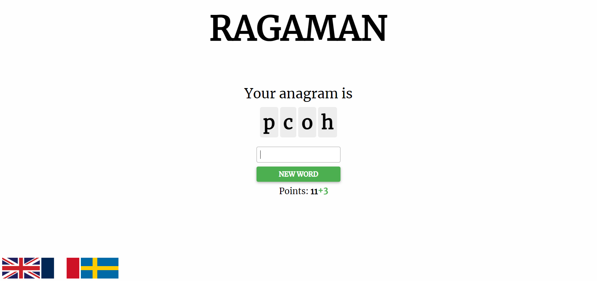

# RAGAMAN

RAGAMAN is an anagram game that you can play in your browser. It supports three languages: French, English, and Swedish. The game presents players with scrambled words, and they have to guess the correct word by rearranging the letters.

## Getting Started

1. Clone the repository: `git clone https://github.com/sanglantes/RAGAMAN.git`
2. Navigate to the project directory: `cd RAGAMAN`
3. Install the required dependencies: `pip install -r requirements.txt`
4. Start the application: `python main.py`
5. Open your browser and visit: `http://localhost:5000`

## Features / un-features

- Anagram game with multiple language support
- Play the game by rearranging letters to form the correct word
- Earn points for correct guesses
- Unresponsive design for smaller devices

## Future Updates

The following features are planned for future updates:

- Online multiplayer mode
- Customizable wordlists
- Settings for game preferences

## Screenshots

